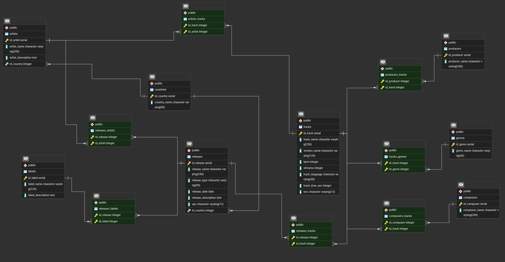

# Music Streaming Platform SQL Project

## Description
Database project simulating a music streaming platform. The goal of it is to extract insights using SQL queries based on different areas of interest such as artists, genres, tracks, and streaming data.

## Queries
- Total streams per artist (used to determine an artist’s overall performance)
- Top 10 artists by streams (which artists are the most listened to on the entire platform, useful for main page recommendations)
- Number of songs per artist (used to determine whether the number of songs an artist has influences visibility)
- Releases with a certain number of songs (used for finding which types of releases perform better)
- Songs above average streams, by country (which songs perform better compared to the average in their region)
- Songs with more than one genre (used to determine genre diversity, detect possible mislabeling, and analyze how genre variety can affect visibility)
- Average streams by genre (to identify which genres are trending)

## Technologies
- PostgreSQL

## Database

## Notes
Project created for learning purposes.
